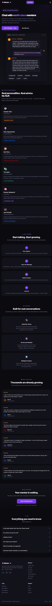
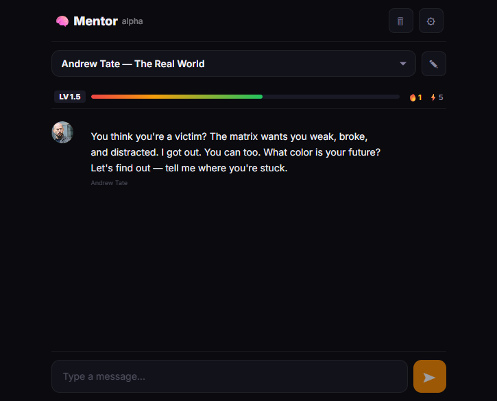

# Mentor AI — Screenshots

## Landing Page
**URL:** https://nuffyofc.github.io/pocketmentorxyz/

### Sections:
- **Hero** — "Chat with world-class mentors" headline, Tate chat preview with 7 mentor chips
- **Choose Your Mentor** — 6 mentor cards (Tate, Gary Vee, Dan Pena, Tai Lopez, Klemen, Jani)
- **How It Works** — 4 steps: Pick → Type → Switch → Level Up
- **Features** — Authentic Voices, No Account Needed, Multiple Providers
- **Testimonials** — 6 user reviews
- **CTA** — "Start Chatting Now" button
- **FAQ** — 6 accordion questions
- **Footer** — mentor list, links, socials

---

## Chat App
**URL:** https://nuffyofc.github.io/pocketmentorxyz/character-ai/

### UI Elements:
- **Header** — Mentor alpha logo, clear chat, settings gear
- **Character Selector** — dropdown with 7 mentors, avatar edit button
- **Stats Bar** — LV counter, happiness bar (red→green), streak, XP
- **Chat Area** — conversation bubbles with mentor avatars + rainbow ring
- **Challenge Overlay** — popup with 30s countdown, accept/decline buttons
- **Input Area** — text field + send button
- **Settings Modal** — provider, API key, model, theme

### Features:
- ✅ 7 AI mentors with unique personalities
- ✅ Emojis in every response
- ✅ Challenge system (every reply → 30s task → +5 XP / -1 happiness)
- ✅ Rainbow avatar ring (grows with XP)
- ✅ Happiness bar (red → orange → yellow → green)
- ✅ Streak tracking
- ✅ No account needed (localStorage)
- ✅ Multi-provider (Groq, OpenRouter, Gemini, OpenAI, Custom)

---

## How to Take Screenshots

1. Open each URL in a desktop browser
2. Take a full-page screenshot:
   - **Chrome:** DevTools → Ctrl+Shift+P → type "screenshot" → "Capture full size screenshot"
   - **Firefox:** Right-click → "Take Screenshot" → "Save full page"
3. Save as `screenshots/landing.png` and `screenshots/chat-app.png`
4. Replace the image paths above with the actual file locations
